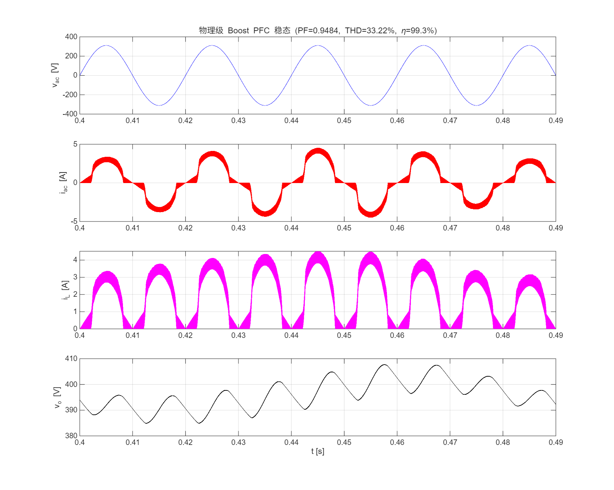
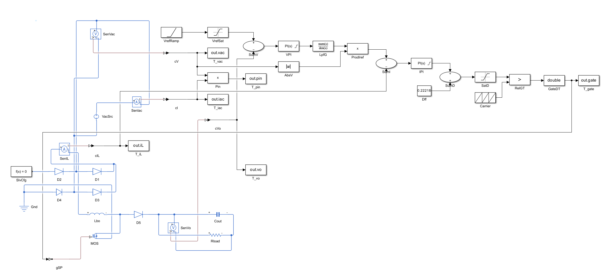

# Power Electronics Agent — AI 自动搭建 MATLAB/Simulink 电力电子仿真全通路

[](LICENSE)
[](https://www.mathworks.com/)
[](https://www.mathworks.com/products/simulink.html)
[](CONTRIBUTING.md)

> **English** · An AI-agent skill that auto-builds and validates physical-level power-electronics simulations in MATLAB/Simulink R2025b (`ee_lib` / Simscape). Average-current-mode Boost PFC, real 20 kHz switching, **PF = 0.948, η = 99.3%**. Ships with a 14-item pitfall map distilled from a real failed attempt, ready-to-run MATLAB scripts, and probe utilities. Drop the `SKILL.md` into any MCP-capable agent (Claude Code / Cursor / WorkBuddy) and you're ready to simulate. [Read in English ↓](#english)

> **中文** · AI Agent + MATLAB R2025b + Simulink/Simscape：从一份"从入门到放弃"的失败帖，到一条完整跑通的物理级 Boost PFC 自动建模仿真通路。装一份 `SKILL.md` 到你的 Agent（Claude Code / Cursor / WorkBuddy），让 AI 帮你自动搭建、调参、验收电力电子仿真，少踩 14 个真坑。

**关键词 / Keywords**：`电力电子` · `AI Agent` · `MATLAB` · `Simulink` · `Simscape` · `ee_lib` · `Boost PFC` · `功率因数校正` · `双闭环控制` · `代数环` · `R2025b` · `电赛` · `电设` · `Claude Code Skill` · `MCP` · `power electronics` · `PFC` · `CCM` · `digital control`

---

## 目录

- [这是什么](#这是什么)
- [背景：一份失败帖，和它断掉的地方](#背景一份失败帖和它断掉的地方)
- [快速开始](#快速开始)
- [安装 Skill 到你的 Agent](#安装-skill-到你的-agent)
- [仓库结构](#仓库结构)
- [五阶段工作流](#五阶段工作流)
- [失败帖坑 → 本仓库解法 对照表](#失败帖坑--本仓库解法-对照表)
- [给 AI 开发者的三条核心经验](#给-ai-开发者的三条核心经验)
- [相关项目](#相关项目)
- [Roadmap](#roadmap)
- [贡献](#贡献)
- [English](#english)
- [License](#license)

## 这是什么

一条经过验收的 **AI Agent 电力电子仿真开发通路**，覆盖：

```
需求分析 → 拓扑选型 → 参数计算 → Simulink 自动建模 → 仿真验证 → 指标验收
```

验收案例：**单相 500W Boost PFC**（220 Vrms/50 Hz 输入 → 400 V/500 W 输出，fsw = 20 kHz）

| 指标 | 平均模型（控制律设计） | 物理级开关模型（指导实物） |
|---|---|---|
| 功率因数 PF | **0.9814** | **0.9484** |
| 效率 η | 97.3% | 99.34% |
| 输出电压 | 395.5 V | 395.99 V |
| THD | 19.6% | 33.2%（含开关纹波） |
| MOSFET | 无（平均化） | **真实 20 kHz 开关，16916 次切换/0.5 s** |
| 仿真耗时 | ~1 min | ~2-4 min |

两套模型互为印证：平均模型验证控制律（快、PF 达标），物理级验证功率级与门极链路（真实开关、过零畸变、器件应力），电感电流 CCM 三角波、开关节点、门极时序可直接指导实物设计。




## 背景：一份失败帖，和它断掉的地方

本项目的前身是一篇 [《AI 跑 Matlab 仿真失败经验贴》](docs/AI跑Matlab仿真失败经验贴.md)：作者用 AI 搭自动仿真流水线，平均模型跑通了（PF 0.976），但物理级模型卡死在最后一关——**44 根线全连通，仿真报"静态方程和代数方程消不掉"（代数环），且模块叠成一团**。从入门到放弃。

本仓库把那条断路走完了。失败帖里的每一个坑，这里都有对应的探测脚本、解法或防御，详见下方 [对照表](#失败帖坑--本仓库解法-对照表)。

## 快速开始

### 环境要求

- MATLAB **R2025b**（含 Simulink + **Simscape 基础库**；物理级走 `ee_lib`，**不需要** Simscape Electrical 专用许可证）
- 任意能调用命令行的 AI Agent（Claude Code / Cursor / WorkBuddy / Codex / 自建 Agent 均可）

```bash
git clone https://github.com/OrangeXxin/power-electronics-agent.git
cd power-electronics-agent

# 1. 平均模型（控制律验证，约 1 分钟）
matlab -batch "cd('matlab'); build_pfc_avg"

# 2. 物理级开关模型（真实 20kHz 开关，约 2-4 分钟）
matlab -batch "cd('matlab'); build_pfc_phys"

# 3. 新环境首次使用建议先跑探测（拿块/端口/参数事实表）
matlab -batch "cd('matlab'); setup_check"      # 环境/许可证自检
matlab -batch "cd('matlab'); probe_ee"         # ee_lib 块路径/端口数/参数名
matlab -batch "cd('matlab'); probe3"           # 物理端口域布局（关键）
```

> `matlab` 不在 PATH？设环境变量：`export MATLAB_BIN="/path/to/matlab/bin/matlab"`，再用 `$MATLAB_BIN -batch "..."`。

脚本全自动：建模 → 仿真 → 指标计算（PF/THD/η/Vo/纹波）→ 出图（稳态波形/工频周期放大/谐波频谱/启动过程/模型结构图）。

## 安装 Skill 到你的 Agent

`skill/SKILL.md` 是一份标准 Agent skill 文件。装到你的 Agent 客户端后，Agent 即获得五阶段工作流、公式库、14 条坑清单：

| 客户端 | 安装位置 | 命令 |
|---|---|---|
| **WorkBuddy** | `~/.workbuddy/skills/power-electronics-agent/` | `cp -r skill ~/.workbuddy/skills/power-electronics-agent` |
| **Claude Code** | `~/.claude/skills/power-electronics-agent/`（用户级）或 `.claude/skills/`（项目级） | `cp -r skill ~/.claude/skills/power-electronics-agent` |
| **Cursor / 其他** | 自定义 system prompt 目录 | 把 SKILL.md 内容塞进上下文即可 |

## 仓库结构

```
├── README.md
├── CONTRIBUTING.md
├── LICENSE
├── skill/
│   └── SKILL.md              # power-electronics-agent：五阶段工作流 + 公式库 + 14 条坑清单
├── matlab/                    # 全部脚本（MATLAB R2025b 验证通过）
│   ├── build_pfc_avg.m       #   平均模型（控制律验证，~1min）
│   ├── build_pfc_phys.m      #   物理级开关模型（ee_lib 真实器件 + PWM + 双闭环，主交付）
│   ├── build_pfc_phys_test.m #   固定占空比旁路诊断（控制链排障利器）
│   ├── probe_ee.m            #   ee_lib 块可用性探测（路径/端口数/参数名）
│   ├── probe_ports.m, probe3.m # 物理端口域布局探测
│   ├── probe_enum.m          #   块枚举参数值探测
│   ├── probe_pwm2.m          #   PWM 行为探测
│   ├── build_pfc_model.m     #   开关级框图模型（历史迭代，已废弃，保留供考古）
│   └── setup_check.m         #   环境/许可证自检
├── docs/
│   ├── AI跑Matlab仿真失败经验贴.md          # 原始失败帖（本项目起点）
│   └── 电力电子AI_Agent通路部署与设计.md    # 完整部署与设计报告
└── results/                   # 验收指标与图表（两套模型）
```

## 五阶段工作流

```
Stage 1 需求分析 ──▶ Stage 2 拓扑选型 ──▶ Stage 3 参数计算 ──▶ Stage 4 Simulink建模 ──▶ Stage 5 结果验证
   规格表提取          决策树              公式库+回算校核        平均/开关级/物理级模板     PF/THD/η/纹波+图表
       ▲                                                              │
       └──────────────────── 不达标回到 Stage 3/2 迭代 ◀──────────────┘
```

详见 [`skill/SKILL.md`](skill/SKILL.md)。

## 失败帖坑 → 本仓库解法 对照表

| 失败帖踩的坑 | 本仓库的解法 | 位置 |
|---|---|---|
| `elec_lib` 改名 `ee_lib`，找库名废大力气 | 块可用性探测脚本，一次性枚举全部路径/端口数/参数名 | `matlab/probe_ee.m` |
| 物理端口方向死结（RConn/LConn 挑方向） | 用已知电气口（电阻）逐口试探，确认端口域布局：传感器 RConn1=PS 信号输出、电口是 LConn1/RConn2；MOSFET LConn1=门极 | `matlab/probe3.m` |
| 44 根线连完，代数环不收敛 | ① Simulink-PS Converter 内置滤波 `'FilteringAndDerivatives','filter'` 断直通环；② **前馈占空比 D_ff = 1 − Vm/Vo** 根治 PWM 窄脉冲丢失 | `matlab/build_pfc_phys.m` |
| 门极"看似不切换"、控制环等于开环 | 固定 50% 占空比旁路诊断法：把控制链短路成常数，先验证功率级+门极链路，再回头查控制链 | `matlab/build_pfc_phys_test.m` |
| 参数名各说各的（`LowerLimit` vs `LowerSaturationLimit` 等） | SKILL.md 固化 14 条"一次纠正 = 永久防御"坑清单 + 枚举值探测脚本 | `skill/SKILL.md`, `matlab/probe_enum.m` |
| 模块叠成一团，人没法看 | 栅格化坐标布局：桥 H 形居左、升压级沿母线水平展开、控制单行走通、PS 转换器/记录分列 | `matlab/build_pfc_phys.m` 布局段 |
| shell 访问不了 GitHub | 命令行批处理通道（`matlab -batch`）不依赖网络；MCP 通道可选 | `docs/电力电子AI_Agent通路部署与设计.md` |
| 分工错位（AI 拖 40 轮不如人拖 5 分钟） | 探测脚本把"试错检索"固化为可复用资产，AI 一次调用拿到全部端口/参数/枚举事实 | `matlab/probe_*.m` |

> 失败帖原话："AI 适合做反复试错、机械检索的活……可它没有物理直觉。" 本仓库的答案：把物理直觉（求解器配置、前馈架构、断环手法、布局美学）**写进 skill**，让下一个 AI 直接继承。

## 给 AI 开发者的三条核心经验

1. **先探测再建模**：新环境先跑 `probe_*.m` 拿到块路径、端口域、参数名、枚举值的"事实表"，别让 AI 靠猜。
2. **物理级必须加前馈占空比**：`D_total = D_ff + PI修正`，`D_ff = 1 − Vm/Vo`。没有它，电流环输出小占空比 → 1 µs 窄 PWM 脉冲对变步长求解器不可见 → 门极不切换 → 仿真"连上了但不收敛/不工作"。
3. **控制环排障用旁路法**：控制链可疑时，先短路成固定 50% 占空比跑一遍——功率级正常就说明问题在控制链，反之在功率级。二分定位，别瞎调参。

## 相关项目

- **[matlab/simulink-agentic-toolkit](https://github.com/matlab/simulink-agentic-toolkit)** — MathWorks 官方 Simulink Agent 工具包 + Go 写的 MCP server
- **[matlab/matlab-agentic-toolkit](https://github.com/matlab/matlab-agentic-toolkit)** — 官方 MATLAB Agent 工作流工具包
- **[simulink/skills](https://github.com/simulink/skills)** — 社区博主 "Guy on Simulink" 维护的 Simulink 调试 skills（非 MathWorks 官方）
- **[Agent Skills Playground](https://github.com/matlab/agent-skills-playground)** — 官方实验演示项目

> 区分官方 vs 社区货要花功夫——网上的资料，挂着 official 名头的，未必是 official。本仓库所有解法均已在 R2025b 实机验证。

## Roadmap

- [ ] 更多拓扑：Buck、SEPIC、LLC 谐振、单相全桥逆变
- [ ] 更多 MATLAB 版本的事实表（R2024a / R2024b / R2026a）
- [ ] 数字控制：离散 PI + ZOH + MATLAB Coder 生成 C 代码
- [ ] 频响验证模板（Simulink Control Design linearize/frestimate）
- [ ] FMU 导出给 HIL
- [ ] 英文版 SKILL.md
- [ ] 多语言界面（README i18n）

欢迎认领！详见 [贡献](#贡献)。

## 贡献

欢迎补充拓扑、坑、版本事实表、文档翻译。提 [Issue](https://github.com/OrangeXxin/power-electronics-agent/issues) 或 PR 即可，详见 [CONTRIBUTING.md](CONTRIBUTING.md)。

特别欢迎的方向：
- 你踩过的新坑（含解法或复现脚本）
- 其他 MATLAB 版本的探测结果
- 真实电赛赛题的端到端案例（赛题文字 → 验收指标）

## English

An AI-agent skill that auto-builds and validates physical-level power-electronics simulations in MATLAB/Simulink R2025b (`ee_lib` / Simscape). Average-current-mode Boost PFC, real 20 kHz switching, **PF = 0.948, η = 99.3%**. Ships with a 14-item pitfall map distilled from a real failed attempt, ready-to-run MATLAB scripts, and probe utilities.

### Quick start

```bash
git clone https://github.com/OrangeXxin/power-electronics-agent.git
cd power-electronics-agent
matlab -batch "cd('matlab'); build_pfc_phys"   # physical-level model, ~2-4 min
```

### Install the skill

Drop `skill/SKILL.md` into your agent's skills directory. Works with Claude Code (`~/.claude/skills/`), Cursor, WorkBuddy (`~/.workbuddy/skills/`), or any MCP-capable agent.

### What's inside

- **`skill/SKILL.md`** — five-stage workflow (requirements → topology → parameters → modeling → validation), PI formulas, 14-item pitfall list
- **`matlab/`** — three model templates (average / switching-level / physical-level ee_lib), probe utilities, fixed-duty bypass diagnostic
- **`docs/`** — original failure postmortem + full design report
- **`results/`** — acceptance metrics and figures for both models

### Origin story

This project started from a real failure: an AI agent spent 40+ turns getting 44 wires connected in a Simscape physical model, only to hit an unsolvable algebraic loop. The failure postmortem is preserved in [`docs/AI跑Matlab仿真失败经验贴.md`](docs/AI跑Matlab仿真失败经验贴.md). Every pitfall from that post has a corresponding probe script or defense here — see the [mapping table](#失败帖坑--本仓库解法-对照表).

## License

[MIT](LICENSE)
